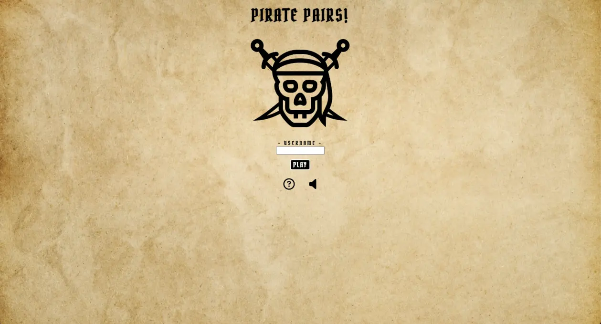
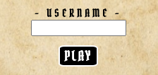
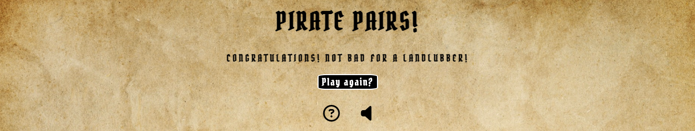

# Pirate Pairs

Pirate Pairs is a fun and simple pirate themed matching pairs memory game, designed to be a quick uncomplicated boredom-beater, to briefly take the user's mind away from whatever it is that they're doing.

## Planning

### Project Aims

### UX

The keyword kept in mind during the design of the user interface was simplicity. Therefore every feature is clear, concise, and available on the same screen, so there is no need for the user to scroll. This simplicity in design allowed for responsiveness across all screen sizes to be achieved with minimal layout changes.

### Background and Colour Scheme

The over-arching colour scheme is also a matter of simplicity. Due to the varying shades of beige, cream and brown of the background image, black text was chosen as the main colour for text as it provides excellent contrast, great for ease of reading.

The background itself was chosen as the "aged-paper" asthetic gives the game a treasure map feel which is synoymous with pirates.

### Fonts/Typography

The main font used for everything bar the how-to popup is the 'Pirata One' font from [Google Fonts](https://fonts.google.com).

As the how-to popup contains dense text, the 'Gill-sans' sans-serif font-family was used for ease of reading.

## Features

### Existing Features

- Introduction screen

As previously mentioned, the site is designed to be as simple as the theme will allow, so as not to overcrowd the site, and over-stimulate the user. A simple black 'line-drawing' style pirate skull icon was chosen to add imagery to the page and to emphasise the theme, without being too 'over the top'. The Screen is headed by the name of the game in the 'Pirata One' font, which stays as a consistent feature in every area of the project.

  - Username input

The username input allows the user to input a name of their choosing to use while playing the game. This is optional, as not everybody will want to do so. The play button, styled to the match the general theme, is a clickable button which moves the user onto the game screen.

  - Controls and how-to popup

The control section is once again as simple as possible. The two font awesome icons can be clicked in order to reveal the description of how to play the game and to turn the game sounds on and off respectively. As can be seen in the second screenshot, the speaker icon changes once clicked to a speaker with soundwaves, instantly recognisable as meaning 'sound on'. These features also remain consistent throughout.

- Game screen

  - Playing cards

Once the user has decided on a username and clicks the play button, the text input and button are hidden and the gameboard is generated in its place. The gameboard itself is a grid of cards, in three rows and four columns, or four rows and three columns if on a mobile device. These cards are face down, and flip once clicked, revealing one of the six possible images. The position of these cards is randomised, so each time the game is played the locations are different. Once two cards have been flipped, if they match the cards are removed from the grid and the pair counter (see below) is updated. If they do not match then the cards are flipped back over and the game carries on. To add to the user experience, a 'page-turn' sound is heard when no match is found and the cards flip back over, and a 'coin purse' sound is heard when a match is found.

The style of the back-face of the cards is a pattern made to look like a classic deck of playing cards, to tie in with the pirate theme. The six front-face icons were chosen for the same reason.

  - Pair counter

The pair counter, situated between the cards and the control section, shows the user how many correct pairs they have found. If the user decided not to enter a username on the introduction pairs, the counter will show 'Your Pairs' plus however many pairs they have found. If, as can be seen in the example shown in the second screenshot, the user decides to enter a name, it will show as '*Username*'s Pairs'.

- Results screen

Once the user has found all possible pairs, the cards and counter are removed to give way for the results screen.

  - Congratulations message

The congratulations message, paired with a 'victorious-trumpet' sound, lets the user know that they have completed the game. The message itself further emphasises the pirate theme, with the use of recognisable pirate phrases such as 'Aaaargh' and 'landlubber'.

  - Play again button

The user then has the option to play again by clicking the play again button. This takes the user back to the game screen with regenrated cards in a random order, and the paircounter reset to zero. The username inputted at the start of the game remains the same. To change this, the user must refresh the browser page.

### Features for the Future

- Two-player mode
- Card-flip animation

#### Ease of Future Development

## Tools and Technologies

- HTML was used for the majority of site content.
- CSS was used for styling, design, and layout.
- Javascript was used to add functionality and interactiveness to the site.
- Git was used for version control.
  - GitHub was used to store the code.
  - GitHub pages waqs used for deployment.
- Codeanywhere was the IDE for the project.
- [Favicon.io](https://favicon.io) was used to generate the favicon.
- [Am I Responsive](https://ui.dev/amiresponsive) was used to generate the main image at the beginning of this document.

## Testing

### Validation

- The HTML was validated with the W3C validator, the result of which can be found [here](https://validator.w3.org/nu/?doc=https%3A%2F%2Fkitlavis.github.io%2Fpirate-pairs%2F).
- The CSS was validated with the W3C CSS validator, the result of which can be found [here](http://jigsaw.w3.org/css-validator/validator?lang=en&profile=css3svg&uri=https%3A%2F%2Fkitlavis.github.io%2Fpirate-pairs%2F&usermedium=all&vextwarning=&warning=1).
- The JavaScript was validated using

### Manual Testing

### Debugging

## Deployment

The project was deployed via GitHub Pages. To do this, the following process was followed:

- While in the GitHub repository, click the settings icon in the nav bar.
- Select the Main Branch from the source section drop-down menu and click save.
- Once succesfully deployed, the deployment can be accessed from the Deployment Section in the right-hand column of the code page of the GitHub repository.

A mentioned above, the project was deployed at a relatively early stage in order to carry out manual testing, and to make sure the site works as designed.

## Credits

### Content

| Source | Authour | Content |
| ------ | ------ | ------ |
| [Youtube](https://www.youtube.com/watch?v=tjyDOHzKN0w&t=306s&ab_channel=CodewithAniaKub%C3%B3w) | Ania Kubów | Inspired the generateCards, flipCard, and checkForMatch functions |
| [Youtube](https://www.youtube.com/watch?v=xWdkt6KSirw&t=439s&ab_channel=JavaScriptAcademy) | JavaScript Academy |  Inspired the restart function |
| [GitHub](https://github.com/davidcalikes/Marvelous-Matching) | David Calikes |  Inspired the muteAudio and toggleAudio functions |

### Media

| Source | Content |
| ------ | ------ |
| [Freepik](https://www.freepik.com/free-photo/wooden-floor-background_4100933.htm#query=treasure%20map&position=3&from_view=keyword&track=ais) | Background image |
| [Icons8](https://icons8.com/icons) | Icons for the favicon, the playing cards, and the skull on the intro-screen |
| [Freesounds](https://freesound.org/) | All audio |
| [Coolors](https://coolors.co/) | Colour scheme image |
| [Google Fonts](https://fonts.google.com/) | 'Pirata One' font |
| [Pattern Monster](https://pattern.monster/) | Pattern for the back face of the playing cards |